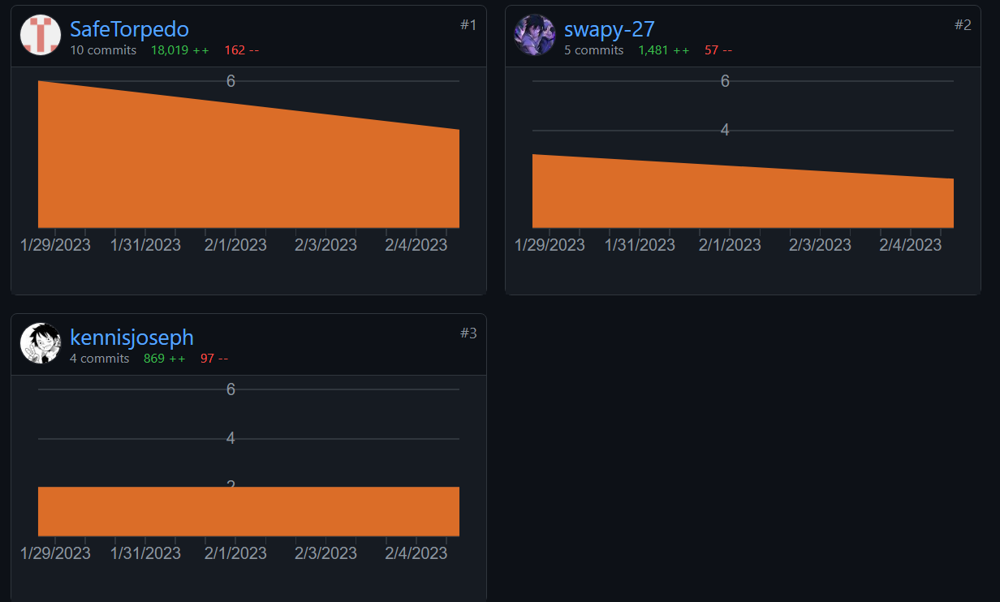
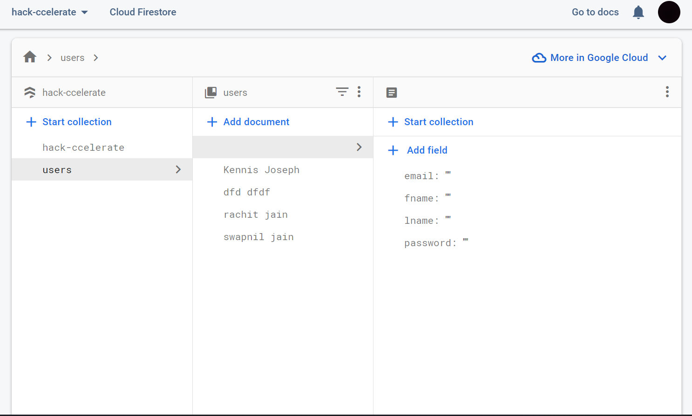

## MotorMate

Have you ever come across a situation where you've had a car breakdown in the middle of nowhere?
Have you ever had to wait for hours for a mechanic to arrive?
Have you ever had to pay a hefty amount for a mechanic to come to your rescue?

Well, we have. And we know how frustrating it can be.

So, we present to you our car dashboard cum webapp **_MotorMate_** for all your last-minute road trip needs.

Our car dashboard themed webapp is designed to help any motorist with nearby road emergency services like Flat tyre, towing services, Fuel/EV stations etc. Our app stores data of such nearby local service providers and is served to the user based on his/her live location collected through Maps.

## Features

-   **Live Location** - The user's live location is collected through Maps and is used to fetch nearby service providers.
-   **Nearby Service Providers** - The user can view nearby service providers based on his/her live location.
-   **Service Provider Details** - The user can view the details of the service provider like contact number, address, etc.
-   **Service Provider Reviews** - The user can view the reviews of the service provider.
-   **Service Provider Ratings** - The user can rate the service provider.

## Tech Stack

-   **Frontend** - HTML, CSS, JavaScript, React, three.js, Mapbox, leaflet.js, tailwindcss
-   **Backend** - Node.js, Firebase

## Installation

1.  Clone the repository

    ```bash
    git clone https://github.com/CodeReaper-10/hack-ccelerate.git
    ```

2.  Install dependencies

    ```bash
    npm install
    ```

3.  Run the app

    ```bash
    npm start
    ```

## Contributors

-   [Adipta Santra](https://github.com/CodeReaper-10)
-   [Pratham Gupta](https://github.com/SafeTorpedo)
-   [Kennis Joseph](https://www.github.com/kennisjoseph)
-   [Swapnil Jain](https://github.com/swapy-27)

## Collaboration chart



## Firbase auth working



